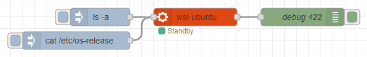
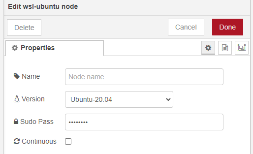
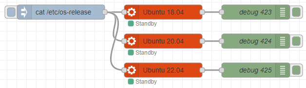
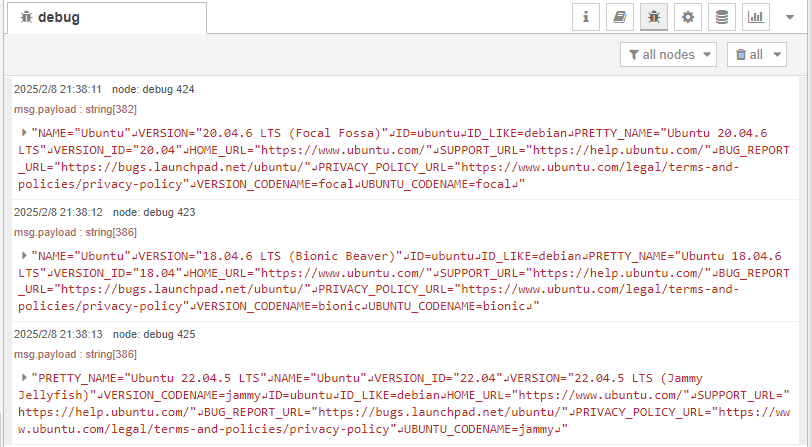
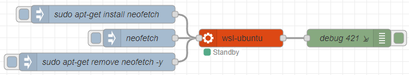
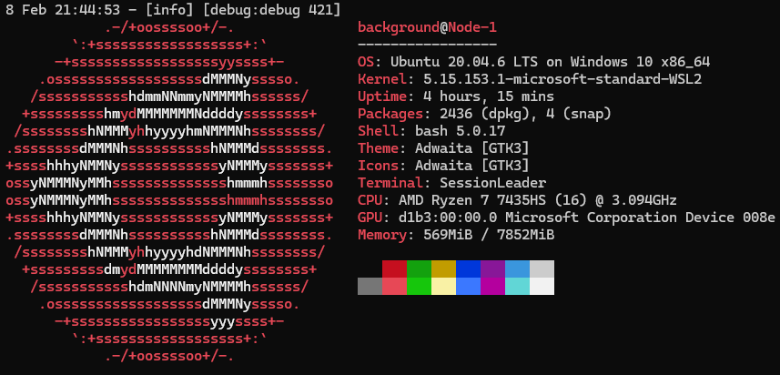

# node-red-contrib-wsl-ubuntu
Node for using Ubuntu environment in WSL with Node-RED

## Overview

This node can execute commands in the WSL Ubuntu environment.

Therefore, **this node works only on Windows**.  
Please install the distribution using the wsl command in advance.  

The node can be set to the following options.  
- Ubuntu version
- Set the password when executing sudo (credential property)
- Whether the execution results are output sequentially or not

Different versions are shown for different Ubuntu environments.

You can also use apt-get to install and remove packages.  
For example, you can output the result of neofetch to System Console.  

